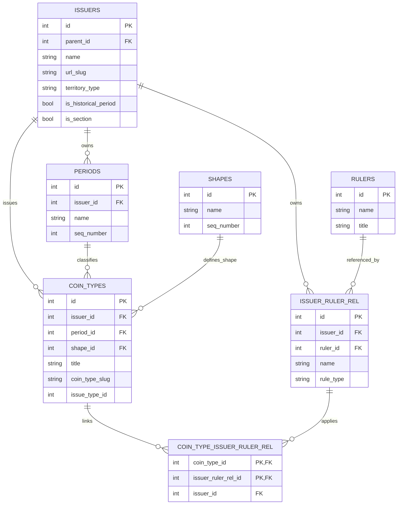

# Sample Schema (Mermaid)

```mermaid
erDiagram
    ISSUERS {
        int id PK
        int parent_id FK
        string name
        string url_slug
        string territory_type
        bool is_historical_period
        bool is_section
    }

    RULERS {
        int id PK
        string name
        string title
    }

    ISSUER_RULER_REL {
        int id PK
        int issuer_id FK
        int ruler_id FK
        string name
        string rule_type
    }

    PERIODS {
        int id PK
        int issuer_id FK
        string name
        int seq_number
    }

    SHAPES {
        int id PK
        string name
        int seq_number
    }

    COIN_TYPES {
        int id PK
        int issuer_id FK
        int period_id FK
        int shape_id FK
        string title
        string coin_type_slug
        int issue_type_id
    }

    COIN_TYPE_ISSUER_RULER_REL {
        int coin_type_id PK,FK
        int issuer_ruler_rel_id PK,FK
        int issuer_id FK
    }

    ISSUERS ||--o{ PERIODS : owns
    ISSUERS ||--o{ ISSUER_RULER_REL : owns
    RULERS ||--o{ ISSUER_RULER_REL : referenced_by

    ISSUERS ||--o{ COIN_TYPES : issues
    PERIODS ||--o{ COIN_TYPES : classifies
    SHAPES ||--o{ COIN_TYPES : defines_shape

    COIN_TYPES ||--o{ COIN_TYPE_ISSUER_RULER_REL : links
    ISSUER_RULER_REL ||--o{ COIN_TYPE_ISSUER_RULER_REL : applies
```

